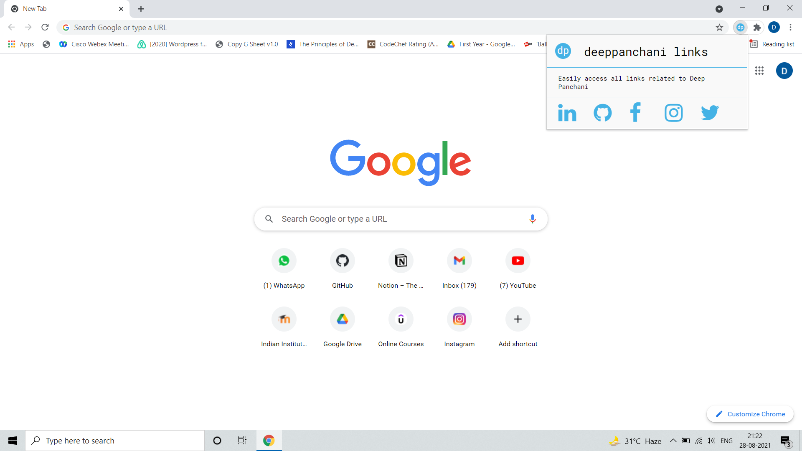
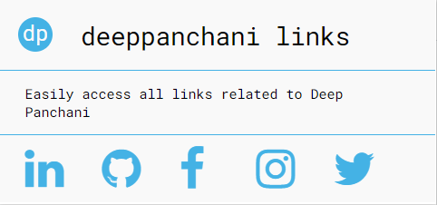
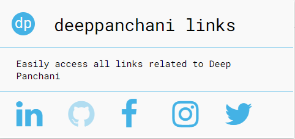

# Project - deeppanchani links
## Problem Statement
I always find myself hunting down my social media profile links when I want to share them or when I want to fill some forms.
## Solution
To overcome the problem I initially thought to have a file containing all the links but it was still not efficient.

So I came up with an idea to make a chrome extension which has all the links in it.
## Sneak Peek

     
    Full View 
     
    Main Page 
     
    Hover Effect 

## How to Download and Install

Download the extension from [here]().

## Built With

    
    
    

## About Me

