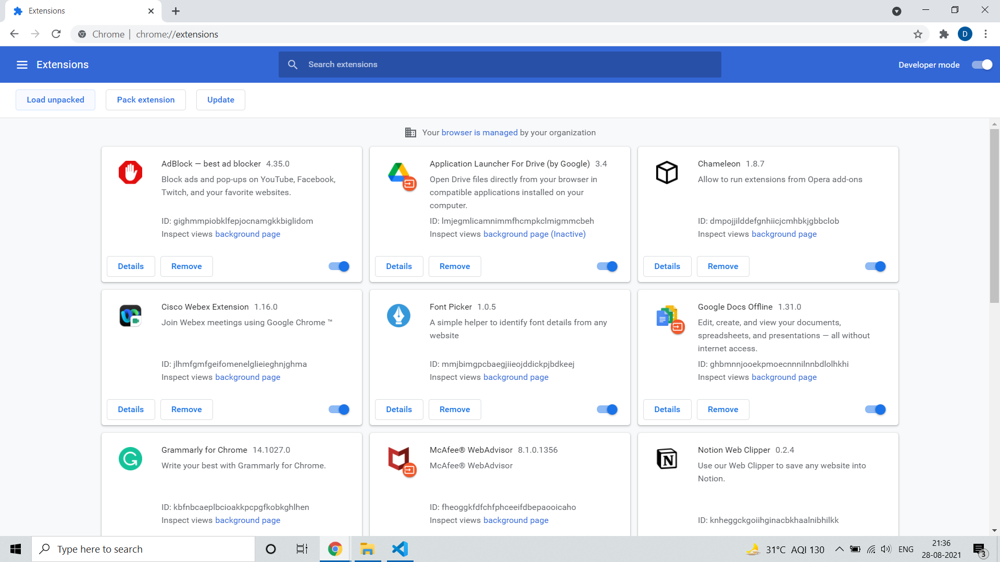

# Project - deeppanchani links
## 😵 Problem Statement
I always find myself hunting down my social media profile links when I want to share them or when I want to fill some forms.
## 💡 Solution
To overcome the problem I initially thought to have a file containing all the links but it was still not efficient.

So I came up with an idea to make a chrome extension which has all the links in it.
## 🧐 Sneak Peek

     
    Full View 
     
    Main Page 
     
    Hover Effect 

## 🤓 How to Download and Install

Download the extension from <a href="https://github.com/deeppanchani/deeppanchani_extension/blob/main/deeppanchani%20links.zip" target="_blank">here</a>.

### Setps to Install

1. Unzip the folder.
2. Save it in a save location. If this folder gets deleted your extension will also get deleted.
3. Open Chrome. Got to menu option.
4. Find "More Tools" option. In that you will find an option names "Extensions".

    

5. On Opening the Extensions. You will find the following screen.
    
    

6. Turn On the Developer Mode.
    
    

7. Select "Load unpacked".
8. Select the unziped files.
    
    
9. Done. You are ready to use the extension.
    
    

## 🧰 Built With

    
    
    

## 🙋‍♂️ About Me

Hey I am Deep Panchani. Computer Science and Engineering student from Indian Institute of Information Technology, Nagpur. 

### Connect with me over:
[LinkedIn](https://www.linkedin.com/in/deep-panchani-7805861b5/)
[Twitter](https://twitter.com/deeppanchani21)
[GitHub](https://github.com/deeppanchani)
[Instagram](https://www.instagram.com/deepanchani/)

_let me tell you somthing, I added this social links by copying them from my extension._
